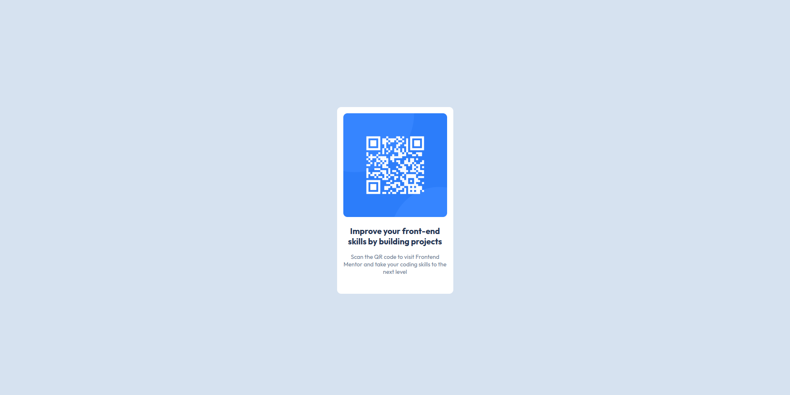

# Frontend Mentor - QR code component solution

This is a solution to the [QR code component challenge on Frontend Mentor](https://www.frontendmentor.io/challenges/qr-code-component-iux_sIO_H). Frontend Mentor challenges help you improve your coding skills by building realistic projects.

## Table of contents

- [Overview](#overview)
  - [Screenshot](#screenshot)
  - [Links](#links)
- [My process](#my-process)
  - [Built with](#built-with)
  - [What I learned](#what-i-learned)
  - [Continued development](#continued-development)
  - [Useful resources](#useful-resources)
- [Author](#author)
- [Acknowledgments](#acknowledgments)

**Note: Delete this note and update the table of contents based on what sections you keep.**

## Overview

### Screenshot

### Links

- Solution URL: [qr-code-component](https://github.com/marloneth/qr-code-component)
- Live Site URL: [Add live site URL here](https://your-live-site-url.com)

## My process

1. I started watching both designs (desktop and mobile) and I could see that the position or sizes in the elements don't changed, so I decided to use fixed sizes for the elements.

2. I started my dev process with the structure (HTML code) using the correct tags to have a correct semantic in my code.

3. Once I had all the structure, image loaded and texts I started with styles. Fir that I used my own css file.

4. In the process of styling also I had to import the Google font used in the design.

5. Once I was convinced with the view of my implementation, I did some small test with different views (mobile, tablet, desktop) and I could see responsiveness on each view.

6. Then I started writing the documentation.

### Built with

- Semantic HTML5 markup
- CSS custom properties
- Flexbox
- Mobile-first workflow

### What I learned

### Continued development

I want to focus my learning on start frontend projects from zero, improve my HTML understanding and be more skilled in Frontend in general.

## Author

- Website - [marloneth](https://github.com/marloneth)
- Frontend Mentor - [@marloneth](https://www.frontendmentor.io/profile/marloneth)
